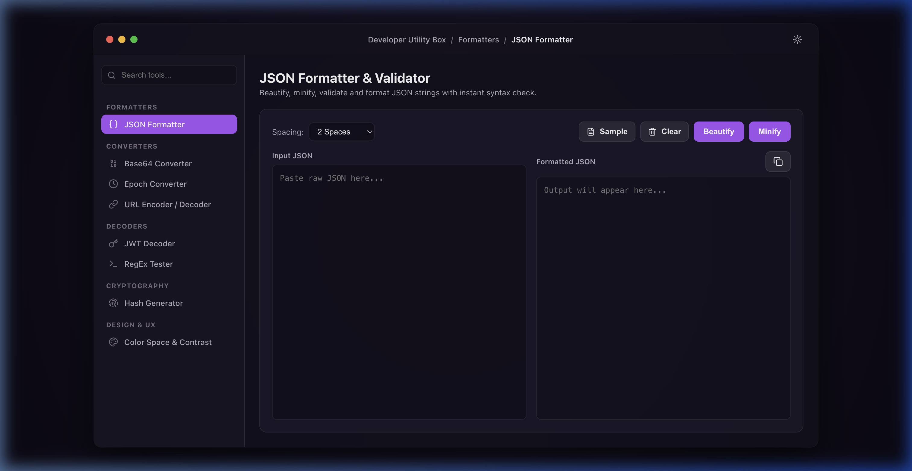
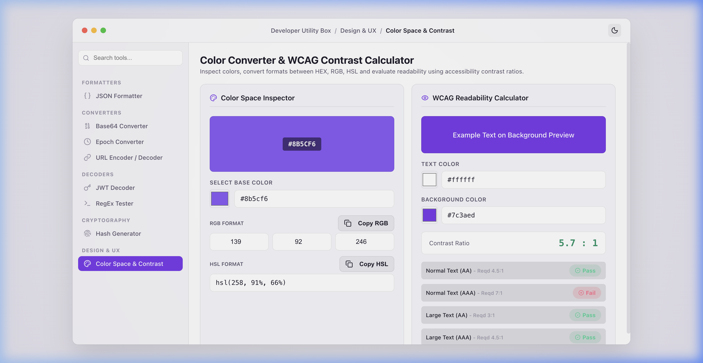
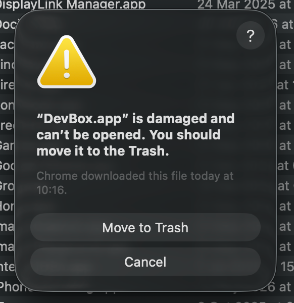

# 🛠️ DevBox - Smart Developer Utility Box

[](https://github.com/arjunr1432/DevBox/releases/latest/download/DevBox-macOS.zip)

> [!IMPORTANT]
> **First-Time macOS Launch Command:**
> Since this app is self-packaged and unsigned, downloading it via a browser will trigger a macOS security message saying the app is *"damaged"*. Bypass this warning by running this command in your Terminal:
> ```bash
> xattr -cr /Applications/DevBox.app
> ```

DevBox is a premium, offline-first developer utility suite styled to mimic a native macOS desktop application. It integrates **21 essential tools** for day-to-day software development into a single, cohesive, glassmorphic workspace — with a built-in dashboard for task management and calendar planning.

Built with **React 19, TypeScript 6, Vite 8, and Electron 42**, it runs completely locally on your machine with zero external network dependencies, ensuring absolute security for sensitive credentials, JWTs, and code snippets.

---

## 📸 Screenshots

| Dark Mode (Default) | Light Mode |
| --- | --- |
|  |  |

---

## ✨ Features

### 📋 Dashboard (Landing Experience)

- ✅ **Task Board** (Default Landing Page): A persistent todo list with priority levels (low/medium/high), color-coded task cards, completion tracking with progress bar, filter by status, and a Quick Notes scratchpad for urgent scribbles. All data is saved to localStorage immediately on every action — survives app crashes, refreshes, and restarts.
- 📅 **Week Calendar**: Interactive weekly view showing the current week number and day highlights, a fully navigatable monthly calendar with week numbers in every row, year progress bar, quick stats (day of year, days remaining, quarter, leap year), and a today footer bar with live epoch time.
- 🔔 **Sidebar Badges**: Live pending task count badge on the Task Board and current week number badge on the Week Calendar — always visible in the navigation.

### 🧰 Developer Tools

- ⚙️ **JSON Formatter & Validator**: Beautify (2/4 spaces or tabs), minify, and validate JSON inputs with instant syntax error locations.
- 📄 **XML Formatter**: Beautify, minify, and validate XML strings with indentation spacing and unbalanced tag checks.
- 🖨️ **SQL Formatter**: Format and indent SQL queries supporting PostgreSQL, MySQL, SQLite, and Standard SQL dialects.
- 📦 **Base64 Converter**: Encode and decode text strings or drag-and-drop files (images, configs) to Base64 and HTML/CSS Data URL streams.
- ⏰ **Epoch Timestamp Converter**: A live-ticking UNIX timestamp banner with pause/copy functions, and bidirectional translation to UTC, Local, and Relative date formats.
- 🔗 **URL Encoder & Decoder**: Encode and decode standard text to percent-encoded URI strings, or decode them back.
- 🔀 **YAML ↔ JSON Converter**: Bidirectional conversion of structures between YAML format and formatted JSON strings, with instant error validation.
- 🔏 **HTML Entity Encoder**: Escape special HTML control characters to entity strings and decode entities back to plain text.
- 🔑 **JWT Decoder**: Inspect JWT tokens, automatically dividing Header, Payload, and Signature metadata with expiry alerts and claims verification.
- 🎯 **RegEx Match Tester**: Compile expressions in real-time, highlight matching nodes safely with infinite-loop prevention, and view matches list.
- ⏰ **Cron Parser & Builder**: Parse cron expressions into human-readable descriptions, construct expressions visually, and predict upcoming runs.
- 🔒 **Cryptographic Hash Generator**: Generate MD5, SHA-1, SHA-256, and SHA-512 checksums instantly and locally.
- 🔢 **UUID Generator**: Batch generate UUID v4 values with one-click copy for each.
- 🔐 **Password Generator & Vault**: Generate cryptographically secure passwords with configurable length and character sets, live strength indicator, and an **optional encrypted local vault** — see details below.
- 🎨 **Color Converter & Contrast Checker**: Convert colors between HEX, RGB, and HSL spaces. Features a WCAG 2.1 contrast ratio calculator with compliance status badges (AA/AAA).
- 🔀 **Text Diff Checker**: Compare text snippets side-by-side or inline using line or word diff highlighting.
- 🔤 **String Case Converter**: Convert text casing between camelCase, snake_case, kebab-case, PascalCase, uppercase, and lowercase.
- 📝 **Live Markdown Previewer**: Compose Markdown syntax and preview the rendered styled HTML output side-by-side.
- 📷 **QR Code Generator**: Generate offline QR codes for raw text, URLs, Wi-Fi networks, and contact cards, with custom foreground/background colors.

### 🔐 Password Generator & Encrypted Vault (Detailed)

The password tool is split into two independent zones:

**Generator (always accessible — no auth required)**
- Configure password length (8–64 chars) via slider
- Toggle character sets: Uppercase, Lowercase, Numbers, Symbols
- Real-time security strength indicator (Weak / Moderate / Strong)
- One-click copy and regenerate

**Encrypted Vault (optional — unlock required)**
- Collapsible vault section below the generator
- Click to unlock → prompts for your master password via an in-app modal (no native dialogs)
- **AES-256-GCM** encryption with **PBKDF2** (SHA-256, 100k iterations) key derivation
- Passwords are **never stored as plain text** — only encrypted blobs in `localStorage`
- Save credentials with website name, optional username, and password (pre-filled from generator)
- Compact scrollable list with inline show/hide, copy username, copy password, and 2-step inline delete confirmation
- Search/filter saved entries in real time
- **Forgot password?** — Reset vault option wipes all data and lets you start fresh (requires typing `RESET` to confirm)
- Lock vault at any time from the vault header

### ⭐ Favorites

- Pin any tool to a **Favorites** section that appears at the top of the sidebar
- Drag-and-drop to **reorder** favorites however you like
- Star icon toggles on every tool card — remove from favorites just as easily

### 🎨 UI & Design

- 🌓 **macOS Light & Dark Themes**: Fully synchronized interface supporting a premium dark glassmorphism layout (default) and a crisp, clean light mode — toggled from the titlebar.
- 🖥️ **Native macOS Feel**: Custom titlebar with traffic lights, breadcrumb navigation, draggable window, and Electron-aware full-viewport mode.
- 💾 **Local Persistence**: Task Board, Quick Notes, Favorites order, and encrypted vault data all persist across sessions via localStorage — no server, no account, no data loss.
- 🔍 **Tool Search**: Fuzzy search across all tools from the sidebar for quick access.

---

## 🛠️ Technology Stack

- **Core**: React 19 + TypeScript 6
- **Build**: Vite 8
- **Styling**: Vanilla CSS (Responsive variables, glassmorphic blur filters, custom scrollbars, and macOS window styling)
- **Icons**: Lucide React
- **Libraries**: `diff` (text diffing), `marked` (markdown), `sql-formatter` (SQL formatting)
- **Encryption**: Web Crypto API — AES-256-GCM + PBKDF2 (built-in, zero dependencies)
- **Desktop Shell**: Electron 42 (CommonJS entrypoint using `.cjs`)
- **Packager**: Electron Packager
- **Persistence**: localStorage (immediate writes, crash-safe)

---

## 📥 Direct Download (macOS)

👉 **[Download DevBox-macOS.zip](https://github.com/arjunr1432/DevBox/releases/latest/download/DevBox-macOS.zip)**

### macOS Gatekeeper Workaround (Required)
Because this application is unsigned, downloading it via a web browser triggers the macOS security quarantine. This displays a warning message stating the app is *"damaged and can't be opened"*:



To fix this and open the app, run the following command in your Terminal:
```bash
xattr -cr /Applications/DevBox.app
```
*(If you run the app from your Downloads folder instead, run `xattr -cr ~/Downloads/DevBox.app`)*

### Installation Instructions
1. Download the **`DevBox-macOS.zip`** archive.
2. Double-click the file to extract **`DevBox.app`**.
3. Drag **`DevBox.app`** into your `/Applications` folder.
4. Run the terminal command shown above.
5. Open the app!

---

## 🚀 Getting Started

### Prerequisites
Make sure you have Node.js (v18+) and npm installed on your MacBook.

### Installation
Clone the repository, enter the folder, and install dependencies:
```bash
npm install
```

### Run Local Development Server (Web)
Runs a hot-reloading development web server:
```bash
npm run dev
```
Open [http://localhost:5173/](http://localhost:5173/) in your web browser.

### Run Desktop Dev Mode (Electron)
Launches the app inside a native macOS Electron framework window with code reloading:
```bash
npm run electron
```

---

## 📦 Packaging Standalone App

To package the project into a standalone, clickable macOS **`.app`** application bundle:

```bash
npm run package:mac
```

This compiles your static assets and outputs a folder under `dist-app/` matching your architecture:
- `dist-app/DevBox-darwin-arm64/DevBox.app` (Apple Silicon Macs)
- `dist-app/DevBox-darwin-x64/DevBox.app` (Intel-based Macs)

**Installation**: Drag the **`DevBox.app`** file directly into your MacBook's `/Applications` directory to launch it native from Launchpad or the Dock!

---

## 🔒 Privacy & Security

DevBox is designed with a **privacy-first** approach:
- All tools execute **100% locally** in the browser runtime or Electron thread.
- Your code snippets, passwords, tokens, API configurations, and file uploads **never leave your computer's CPU**.
- Vault passwords are encrypted with **AES-256-GCM** using a key derived from your master password — even the app itself cannot read them without your key.
- Task data, notes, and favorites are stored in localStorage on your machine — never synced or transmitted anywhere.
- Fully operational **offline**.
