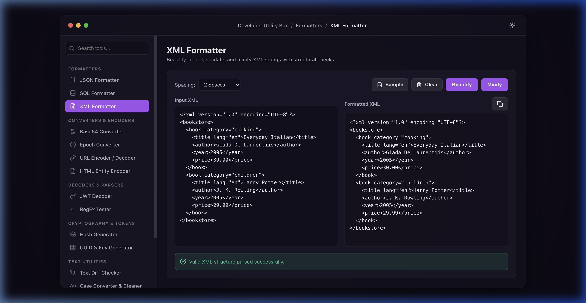

# 🛠️ DevBox - Smart Developer Utility Box

DevBox is a premium, offline-first developer utility suite styled to mimic a native macOS desktop application. It integrates essential tools for day-to-day software development into a single, cohesive, glassmorphic workspace.

Built with **React, TypeScript, Vite, and Electron**, it runs completely locally on your machine with zero external network dependencies, ensuring absolute security for sensitive credentials, JWTs, and code snippets.

---

## 📸 Screenshots

| Dark Mode (Default) | Light Mode |
| --- | --- |
|  |  |

### XML Formatter Utility


---

## ✨ Features

- ⚙️ **JSON Formatter & Validator**: Beautify (2/4 spaces or tabs), minify, and validate JSON inputs with instant syntax error locations.
- 📄 **XML Formatter**: Beautify, minify, and validate XML strings with indentation spacing and unbalanced tag checks.
- 🖨️ **SQL Formatter**: Format and indent SQL queries supporting PostgreSQL, MySQL, SQLite, and Standard SQL dialects.
- 📦 **Base64 Converter**: Encode and decode text strings or drag-and-drop files (images, configs) to Base64 and HTML/CSS Data URL streams.
- ⏰ **Epoch Timestamp Converter**: A live-ticking UNIX timestamp banner with pause/copy functions, and bidirectional translation to UTC, Local, and Relative date formats.
- 🔏 **HTML Entity Encoder**: Escape special HTML control characters to entity strings and decode entities back to plain text.
- 🔑 **JWT Decoder**: Inspect JWT tokens, automatically dividing Header, Payload, and Signature metadata with expiry alerts and claims verification.
- 🎯 **RegEx Match Tester**: Compile expressions in real-time, highlight matching nodes safely with infinite-loop prevention, and view matches list.
- 🔒 **Cryptographic Hash Generator**: Generate MD5, SHA-1, SHA-256, and SHA-512 checksums instantly and locally.
- 🔑 **UUID & Key Generator**: Batch generate UUID v4 values or create strong custom password keys with strength indicators.
- 🎨 **Color Converter & Contrast Checker**: Convert colors between HEX, RGB, and HSL spaces. Features a WCAG 2.1 contrast ratio calculator with compliance status badges (AA/AAA).
- 🔀 **Text Diff Checker**: Compare text snippets side-by-side or inline using line or word diff highlighting.
- 🔤 **String Case Converter**: Convert text casing between camelCase, snake_case, kebab-case, PascalCase, uppercase, and lowercase.
- 📝 **Live Markdown Previewer**: Compose Markdown syntax and preview the rendered styled HTML output side-by-side.
- 🌓 **macOS Light & Dark Themes**: Fully synchronized interface supporting a premium dark glassmorphism layout (default) and a crisp, clean light mode.

---

## 🛠️ Technology Stack

- **Core**: React 19 + TypeScript
- **Styling**: Vanilla CSS (Responsive variables, glassmorphic blur filters, custom scrollbars, and macOS window styling)
- **Icons**: Lucide React
- **Desktop Shell**: Electron (CommonJS entrypoint using `.cjs`)
- **Packager**: Electron Packager

---

## 🚀 Getting Started

### Prerequisites
Make sure you have Node.js (v18+) and npm installed on your MacBook.

### Installation
Clone the repository, enter the folder, and install dependencies:
```bash
npm install
```

### Run Local Development Server (Web)
Runs a hot-reloading development web server:
```bash
npm run dev
```
Open [http://localhost:5173/](http://localhost:5173/) in your web browser.

### Run Desktop Dev Mode (Electron)
Launches the app inside a native macOS Electron framework window with code reloading:
```bash
npm run electron
```

---

## 📦 Packaging Standalone App

To package the project into a standalone, clickable macOS **`.app`** application bundle:

```bash
npm run package:mac
```

This compiles your static assets and outputs a folder under `dist-app/` matching your architecture:
- `dist-app/DevBox-darwin-arm64/DevBox.app` (Apple Silicon Macs)
- `dist-app/DevBox-darwin-x64/DevBox.app` (Intel-based Macs)

**Installation**: Drag the **`DevBox.app`** file directly into your MacBook's `/Applications` directory to launch it native from Launchpad or the Dock!

---

## 🔒 Privacy & Security

DevBox is designed with a **privacy-first** approach:
- All tools execute **100% locally** in the browser runtime or Electron thread.
- Your code snippets, passwords, tokens, API configurations, and file uploads never leave your computer's CPU.
- Fully operational offline.
